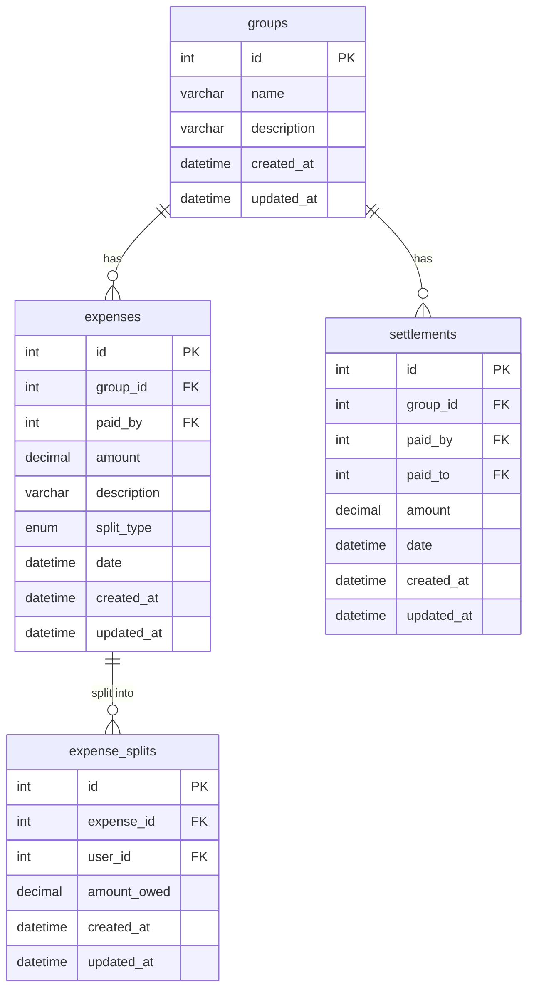

# DATABASE_SCHEMA.md — SplitKaro

**ORM:** Sequelize v6  
**Database:** MySQL  
**Schema name:** `splitKaro_db`  
**Migration tool:** sequelize-cli  
**Naming convention:** migrations use `snake_case` column names; Sequelize models use `underscored: true` to map camelCase JS properties to snake_case DB columns automatically.

---

## 1. Entity List

| Table | Sequelize Model | Purpose |
|---|---|---|
| `groups` | `Groups` | A named collection of people sharing expenses |
| `expenses` | `Expenses` | A single payment made by one member on behalf of the group |
| `expense_splits` | `ExpenseSplits` | Per-member share of a single expense (one row per member per expense) |
| `settlements` | `Settlements` | A direct payment from one member to another to clear a debt |
| `users` | `User` | A platform-level identity for authentication (password or Google OAuth) |
| `group_members` | `GroupMember` | Join table linking users to the groups they belong to (many-to-many) |

---

## 2. Fields

### `groups`

| Column | JS Property | Type | Nullable | Unique | Default | Model Validation |
|---|---|---|---|---|---|---|
| `id` | `id` | `INT` AUTO_INCREMENT PK | No | Yes (PK) | — | `isInt`, `min: 1` |
| `name` | `name` | `VARCHAR(255)` | No | No | — | `notEmpty` |
| `description` | `description` | `VARCHAR(255)` | **Yes** | No | — | none |
| `created_by` | `createdBy` | `INT` FK → `users.id` | **Yes** | No | — | `isInt` |
| `invite_token` | `inviteToken` | `VARCHAR(255)` | No | **Yes** | — | `notEmpty` |
| `created_at` | `createdAt` | `DATETIME` | No | No | `CURRENT_TIMESTAMP` | — |
| `updated_at` | `updatedAt` | `DATETIME` | No | No | `CURRENT_TIMESTAMP` | — |

### `expenses`

| Column | JS Property | Type | Nullable | Unique | Default | Model Validation |
|---|---|---|---|---|---|---|
| `id` | `id` | `INT` AUTO_INCREMENT PK | No | Yes (PK) | — | `isInt`, `min: 1` |
| `group_id` | `groupId` | `INT` FK → `groups.id` | No | No | — | `isInt` |
| `paid_by` | `paidBy` | `INT` FK → `users.id` | No | No | — | `isInt` |
| `amount` | `amount` | `DECIMAL(10,2)` | No | No | — | `isDecimal`, `min: 0` |
| `description` | `description` | `VARCHAR(255)` | No | No | — | `notEmpty` |
| `split_type` | `splitType` | `ENUM('equal','exact','percentage')` | No | No | — | `isIn: ['equal','exact','percentage']` |
| `date` | `date` | `DATETIME` | No | No | `CURRENT_TIMESTAMP` | `isDate` |
| `created_at` | `createdAt` | `DATETIME` | No | No | `CURRENT_TIMESTAMP` | — |
| `updated_at` | `updatedAt` | `DATETIME` | No | No | `CURRENT_TIMESTAMP` | — |

---

### `expense_splits`

| Column | JS Property | Type | Nullable | Unique | Default | Model Validation |
|---|---|---|---|---|---|---|
| `id` | `id` | `INT` AUTO_INCREMENT PK | No | Yes (PK) | — | `isInt`, `min: 1` |
| `expense_id` | `expenseId` | `INT` FK → `expenses.id` | No | No | — | `isInt` |
| `user_id` | `userId` | `INT` FK → `users.id` | No | No | — | `isInt` |
| `amount_owed` | `amountOwed` | `DECIMAL(10,2)` | No | No | — | `isDecimal`, `min: 0` |
| `created_at` | `createdAt` | `DATETIME` | No | No | `CURRENT_TIMESTAMP` | — |
| `updated_at` | `updatedAt` | `DATETIME` | No | No | `CURRENT_TIMESTAMP` | — |

> **Note on amount_owed = 0:** The seeder inserts a row with `amount_owed = 0.00` for member 3 on expense 5 (percentage split). The model validates `min: 0` (not `min: 0.01`), so zero-value splits are accepted. This is legal but may be confusing in UI — a member who owes nothing still gets a split row.

---

### `settlements`

| Column | JS Property | Type | Nullable | Unique | Default | Model Validation |
|---|---|---|---|---|---|---|
| `id` | `id` | `INT` AUTO_INCREMENT PK | No | Yes (PK) | — | `isInt`, `min: 1` |
| `group_id` | `groupId` | `INT` FK → `groups.id` | No | No | — | `isInt` |
| `paid_by` | `paidBy` | `INT` FK → `users.id` | No | No | — | `isInt` |
| `paid_to` | `paidTo` | `INT` FK → `users.id` | No | No | — | `isInt` |
| `amount` | `amount` | `DECIMAL(10,2)` | No | No | — | `isDecimal`, `min: 0` |
| `date` | `date` | `DATETIME` | No | No | `CURRENT_TIMESTAMP` | `isDate` |
| `created_at` | `createdAt` | `DATETIME` | No | No | `CURRENT_TIMESTAMP` | — |
| `updated_at` | `updatedAt` | `DATETIME` | No | No | `CURRENT_TIMESTAMP` | — |

---

### `users`

| Column | JS Property | Type | Nullable | Unique | Default | Model Validation |
|---|---|---|---|---|---|---|
| `id` | `id` | `INT` AUTO_INCREMENT PK | No | Yes (PK) | — | `isInt`, `min: 1` |
| `name` | `name` | `VARCHAR(255)` | No | No | — | `notEmpty` |
| `email` | `email` | `VARCHAR(255)` | No | **Yes** | — | `isEmail`, `notEmpty` |
| `password_hash` | `passwordHash` | `VARCHAR(255)` | **Yes** | No | — | none |
| `google_id` | `googleId` | `VARCHAR(255)` | **Yes** | **Yes** | — | none |
| `avatar_url` | `avatarUrl` | `VARCHAR(255)` | **Yes** | No | — | none |
| `is_email_verified` | `isEmailVerified` | `BOOLEAN` | No | No | `false` | none |
| `created_at` | `createdAt` | `DATETIME` | No | No | `CURRENT_TIMESTAMP` | — |
| `updated_at` | `updatedAt` | `DATETIME` | No | No | `CURRENT_TIMESTAMP` | — |

> **Model-level validation:** At least one of `password_hash` or `google_id` must be non-null. A user must have signed up via password OR Google OAuth, never neither.

---

### `group_members`

| Column | JS Property | Type | Nullable | Unique | Default | Model Validation |
|---|---|---|---|---|---|---|
| `id` | `id` | `INT` AUTO_INCREMENT PK | No | Yes (PK) | — | `isInt`, `min: 1` |
| `user_id` | `userId` | `INT` FK → `users.id` | No | No | — | `isInt` |
| `group_id` | `groupId` | `INT` FK → `groups.id` | No | No | — | `isInt` |
| `joined_at` | `joinedAt` | `DATETIME` | No | No | `CURRENT_TIMESTAMP` | — |
| `created_at` | `createdAt` | `DATETIME` | No | No | `CURRENT_TIMESTAMP` | — |
| `updated_at` | `updatedAt` | `DATETIME` | No | No | `CURRENT_TIMESTAMP` | — |

> **Composite unique constraint:** `(user_id, group_id)` — enforced at the DB level via migration index `group_members_user_id_group_id_unique`. Prevents the same user from joining the same group twice. No `role` column — all group members share equal permissions (Splitwise model).

---

## 3. Relationships

| From | Cardinality | To | FK Column (in DB) | Alias | ON DELETE |
|---|---|---|---|---|---|
| `groups` | 1 → N | `expenses` | `expenses.group_id` | `expenses` / `group` | CASCADE |
| `groups` | 1 → N | `settlements` | `settlements.group_id` | `settlements` / `group` | CASCADE |
| `groups` | M ↔ N | `users` (via `group_members`) | `group_members.group_id` | `users` / `group` | CASCADE |
| `users` | 1 → N | `groups` (as creator) | `groups.created_by` | `createdGroups` / `creator` | SET NULL |
| `users` | M ↔ N | `groups` (via `group_members`) | `group_members.user_id` | `groups` / `user` | CASCADE |
| `users` | 1 → N | `expenses` | `expenses.paid_by` | `expensesPaid` / `payer` | RESTRICT |
| `users` | 1 → N | `expense_splits` | `expense_splits.user_id` | `expenseSplits` / `user` | RESTRICT |
| `users` | 1 → N | `settlements` (as payer) | `settlements.paid_by` | `settlementsPaid` / `payer` | RESTRICT |
| `users` | 1 → N | `settlements` (as payee) | `settlements.paid_to` | `settlementsReceived` / `payee` | RESTRICT |
| `expenses` | 1 → N | `expense_splits` | `expense_splits.expense_id` | `splits` / `expense` | CASCADE |

## 4. Relationship Diagram (Mermaid ER)

---

## 5. Indexes

The following indexes are confirmed to exist based on the migrations and Sequelize model definitions.

| Table | Column(s) | Index Type | Source |
|---|---|---|---|
| `groups` | `id` | PRIMARY KEY (clustered) | Migration |
| `groups` | `invite_token` | UNIQUE (`groups_invite_token`) | Migration |
| `expenses` | `id` | PRIMARY KEY (clustered) | Migration |
| `expenses` | `group_id` | SECONDARY (`expenses_group_id`) | Migration |
| `expenses` | `paid_by` | SECONDARY (`expenses_paid_by`) | Migration |
| `expense_splits` | `id` | PRIMARY KEY (clustered) | Migration |
| `expense_splits` | `expense_id` | SECONDARY (`expense_splits_expense_id`) | Migration |
| `expense_splits` | `user_id` | SECONDARY (`expense_splits_user_id`) | Migration |
| `expense_splits` | `expense_id, user_id` | UNIQUE (`expense_splits_expense_id_user_id_unique`) | Migration + Model |
| `settlements` | `id` | PRIMARY KEY (clustered) | Migration |
| `settlements` | `group_id` | SECONDARY (`settlements_group_id`) | Migration |
| `settlements` | `paid_by` | SECONDARY (`settlements_paid_by`) | Migration |
| `settlements` | `paid_to` | SECONDARY (`settlements_paid_to`) | Migration |
| `users` | `id` | PRIMARY KEY (clustered) | Migration |
| `users` | `email` | UNIQUE (`users_email`) | Migration |
| `users` | `google_id` | UNIQUE (`users_google_id`) | Migration |
| `group_members` | `id` | PRIMARY KEY (clustered) | Migration |
| `group_members` | `user_id` | SECONDARY (`group_members_user_id`) | Migration |
| `group_members` | `group_id` | SECONDARY (`group_members_group_id`) | Migration |
| `group_members` | `user_id, group_id` | UNIQUE (`group_members_user_id_group_id_unique`) | Migration |

**Explicit secondary indexes and unique indexes are defined via migrations to optimize common queries and safeguard relationships.**

---

## 6. Known Gaps

### Normalisation issues

| Issue | Detail |
|---|---|
| No currency field | All monetary values are stored as plain `DECIMAL(10,2)` with no currency column. The UI hard-codes `₹` (Indian Rupee). Multi-currency support would require a schema change. |
| `description` on `groups` and `expenses` is unbounded VARCHAR(255) | Sequelize maps `DataTypes.STRING` to `VARCHAR(255)`. Long descriptions are silently truncated. A `TEXT` column would be more appropriate for the expense description. |

---

## Not Yet Modeled

Features implied by the codebase that have no corresponding data model:

| Feature | Evidence | What is missing |
|---|---|---|
| **User accounts / authentication** *(partially addressed)* | Auth schema added, but API implementation still needed | Still needed: full auth flow (JWT, Google OAuth) |
| **Group membership by existing users** *(addressed)* | `group_members` join table added, `users` now act as members | Fully addressed — the old `members` table concept is completely retired and dropped |
| **Expense categories / tags** | Not present anywhere | A `categories` table and a `category_id` FK on `expenses` |
| **Expense receipts / attachments** | Not present anywhere | A file-reference column or separate `attachments` table on `expenses` |
| **Audit / activity log** | No event history | An `activity_log` table recording creates, deletes, and settlements for a group timeline |
| **Notifications** | Not present anywhere | A `notifications` table or push-token column on users |

---

## 7. Migration Notes

*   **check_settlement_self_pay**: A check constraint (`CHECK (paid_by <> paid_to)`) exists on the `settlements` table. It was dropped and recreated during the `repair-settlements-fk-repoint` migration to bypass a MySQL limitation that blocks adding a foreign key referential action to a column that is actively referenced by a check constraint.

*   **Sub-step 4c - members table dropped**: The `members` table was fully retired and dropped, completing the foundational transition from group-scoped members to platform-level `users`. All relationships are now mapped properly to `users`.
