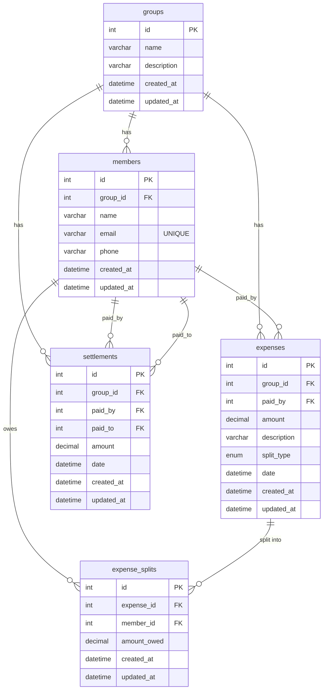

# DATABASE_SCHEMA.md — SplitKaro

**ORM:** Sequelize v6  
**Database:** MySQL  
**Schema name:** `splitKaro_db`  
**Migration tool:** sequelize-cli  
**Naming convention:** migrations use `snake_case` column names; Sequelize models use `underscored: true` to map camelCase JS properties to snake_case DB columns automatically.

---

## 1. Entity List

| Table | Sequelize Model | Purpose |
|---|---|---|
| `groups` | `Groups` | A named collection of people sharing expenses |
| `members` | `Members` | An individual participant who belongs to exactly one group |
| `expenses` | `Expenses` | A single payment made by one member on behalf of the group |
| `expense_splits` | `ExpenseSplits` | Per-member share of a single expense (one row per member per expense) |
| `settlements` | `Settlements` | A direct payment from one member to another to clear a debt |

---

## 2. Fields

### `groups`

| Column | JS Property | Type | Nullable | Unique | Default | Model Validation |
|---|---|---|---|---|---|---|
| `id` | `id` | `INT` AUTO_INCREMENT PK | No | Yes (PK) | — | `isInt`, `min: 1` |
| `name` | `name` | `VARCHAR(255)` | No | No | — | `notEmpty` |
| `description` | `description` | `VARCHAR(255)` | **Yes** | No | — | none |
| `created_at` | `createdAt` | `DATETIME` | No | No | `CURRENT_TIMESTAMP` | — |
| `updated_at` | `updatedAt` | `DATETIME` | No | No | `CURRENT_TIMESTAMP` | — |

---

### `members`

| Column | JS Property | Type | Nullable | Unique | Default | Model Validation |
|---|---|---|---|---|---|---|
| `id` | `id` | `INT` AUTO_INCREMENT PK | No | Yes (PK) | — | `isInt`, `min: 1` |
| `group_id` | `groupId` | `INT` FK → `groups.id` | No | No | — | `isInt` |
| `name` | `name` | `VARCHAR(255)` | No | No | — | `notEmpty` |
| `email` | `email` | `VARCHAR(255)` | No | **Yes** | — | `isEmail`, `notEmpty` |
| `phone` | `phone` | `VARCHAR(255)` | No | No | — | `notEmpty` |
| `created_at` | `createdAt` | `DATETIME` | No | No | `CURRENT_TIMESTAMP` | — |
| `updated_at` | `updatedAt` | `DATETIME` | No | No | `CURRENT_TIMESTAMP` | — |

> **Note:** `email` is globally unique across all groups — a single person cannot be a member of two different groups using the same email address. This is a significant modelling limitation (see Section 6).

---

### `expenses`

| Column | JS Property | Type | Nullable | Unique | Default | Model Validation |
|---|---|---|---|---|---|---|
| `id` | `id` | `INT` AUTO_INCREMENT PK | No | Yes (PK) | — | `isInt`, `min: 1` |
| `group_id` | `groupId` | `INT` FK → `groups.id` | No | No | — | `isInt` |
| `paid_by` | `paidBy` | `INT` FK → `members.id` | No | No | — | `isInt` |
| `amount` | `amount` | `DECIMAL(10,2)` | No | No | — | `isDecimal`, `min: 0` |
| `description` | `description` | `VARCHAR(255)` | No | No | — | `notEmpty` |
| `split_type` | `splitType` | `ENUM('equal','exact','percentage')` | No | No | — | `isIn: ['equal','exact','percentage']` |
| `date` | `date` | `DATETIME` | No | No | `CURRENT_TIMESTAMP` | `isDate` |
| `created_at` | `createdAt` | `DATETIME` | No | No | `CURRENT_TIMESTAMP` | — |
| `updated_at` | `updatedAt` | `DATETIME` | No | No | `CURRENT_TIMESTAMP` | — |

---

### `expense_splits`

| Column | JS Property | Type | Nullable | Unique | Default | Model Validation |
|---|---|---|---|---|---|---|
| `id` | `id` | `INT` AUTO_INCREMENT PK | No | Yes (PK) | — | `isInt`, `min: 1` |
| `expense_id` | `expenseId` | `INT` FK → `expenses.id` | No | No | — | `isInt` |
| `member_id` | `memberId` | `INT` FK → `members.id` | No | No | — | `isInt` |
| `amount_owed` | `amountOwed` | `DECIMAL(10,2)` | No | No | — | `isDecimal`, `min: 0` |
| `created_at` | `createdAt` | `DATETIME` | No | No | `CURRENT_TIMESTAMP` | — |
| `updated_at` | `updatedAt` | `DATETIME` | No | No | `CURRENT_TIMESTAMP` | — |

> **Note on amount_owed = 0:** The seeder inserts a row with `amount_owed = 0.00` for member 3 on expense 5 (percentage split). The model validates `min: 0` (not `min: 0.01`), so zero-value splits are accepted. This is legal but may be confusing in UI — a member who owes nothing still gets a split row.

---

### `settlements`

| Column | JS Property | Type | Nullable | Unique | Default | Model Validation |
|---|---|---|---|---|---|---|
| `id` | `id` | `INT` AUTO_INCREMENT PK | No | Yes (PK) | — | `isInt`, `min: 1` |
| `group_id` | `groupId` | `INT` FK → `groups.id` | No | No | — | `isInt` |
| `paid_by` | `paidBy` | `INT` FK → `members.id` | No | No | — | `isInt` |
| `paid_to` | `paidTo` | `INT` FK → `members.id` | No | No | — | `isInt` |
| `amount` | `amount` | `DECIMAL(10,2)` | No | No | — | `isDecimal`, `min: 0` |
| `date` | `date` | `DATETIME` | No | No | `CURRENT_TIMESTAMP` | `isDate` |
| `created_at` | `createdAt` | `DATETIME` | No | No | `CURRENT_TIMESTAMP` | — |
| `updated_at` | `updatedAt` | `DATETIME` | No | No | `CURRENT_TIMESTAMP` | — |

---

## 3. Relationships

| From | Cardinality | To | FK Column (in DB) | Alias | ON DELETE |
|---|---|---|---|---|---|
| `groups` | 1 → N | `members` | `members.group_id` | `members` / `group` | CASCADE |
| `groups` | 1 → N | `expenses` | `expenses.group_id` | `expenses` / `group` | CASCADE |
| `groups` | 1 → N | `settlements` | `settlements.group_id` | `settlements` / `group` | CASCADE |
| `members` | 1 → N | `expenses` | `expenses.paid_by` | `expensesPaid` / `payer` | CASCADE |
| `members` | 1 → N | `expense_splits` | `expense_splits.member_id` | `expenseSplits` / `member` | CASCADE |
| `members` | 1 → N | `settlements` (as payer) | `settlements.paid_by` | `settlementsPaid` / `payer` | CASCADE |
| `members` | 1 → N | `settlements` (as payee) | `settlements.paid_to` | `settlementsReceived` / `payee` | CASCADE |
| `expenses` | 1 → N | `expense_splits` | `expense_splits.expense_id` | `splits` / `expense` | CASCADE |

### Defect: broken `ExpenseSplits.associate` registration

`ExpenseSplits.js` defines `ExpenseSplits.associate` **twice**. In JavaScript, assigning a property twice overwrites the first assignment, so only the second block (the `belongsTo Members`) is ever registered. The `belongsTo Expenses` association is silently dropped. As a result:

- Querying `ExpenseSplits` with `include: Expenses` will fail or return unexpected results at runtime.
- The `expense_splits.expense_id` FK column and the CASCADE rule exist in the DB (migration is correct), but the Sequelize ORM-level association object is missing.

---

## 4. Relationship Diagram (Mermaid ER)

---

## 5. Indexes

The following indexes are confirmed to exist based on the migrations and Sequelize model definitions. No `queryInterface.addIndex()` calls appear anywhere in the migration files — only the implicit indexes MySQL creates automatically.

| Table | Column(s) | Index Type | Source |
|---|---|---|---|
| `groups` | `id` | PRIMARY KEY (clustered) | Migration |
| `members` | `id` | PRIMARY KEY (clustered) | Migration |
| `members` | `email` | UNIQUE | Migration + Model |
| `expenses` | `id` | PRIMARY KEY (clustered) | Migration |
| `expense_splits` | `id` | PRIMARY KEY (clustered) | Migration |
| `settlements` | `id` | PRIMARY KEY (clustered) | Migration |

**No explicit secondary indexes are defined anywhere in the codebase.**

MySQL InnoDB will create implicit indexes for foreign key columns automatically (`group_id`, `paid_by`, `paid_to`, `expense_id`, `member_id`), but these are engine-managed and not declared in migrations.

---

## 6. Known Gaps

### Missing explicit secondary indexes

| Table | Column | Why it needs an index | Current state |
|---|---|---|---|
| `expenses` | `group_id` | Every expense query filters by group — used in every page load | Implicit FK index only |
| `expenses` | `paid_by` | Balance calculation iterates expenses per payer | Implicit FK index only |
| `expense_splits` | `expense_id` | Every split lookup joins on expense_id | Implicit FK index only |
| `expense_splits` | `member_id` | Balance calculation aggregates splits per member | Implicit FK index only |
| `settlements` | `group_id` | Settlement listing and balance calc filter by group | Implicit FK index only |

These implicit FK indexes _do_ exist in InnoDB, but they are not declared in migrations. This means they would not be reproduced on a non-InnoDB engine, and they cannot be easily documented, tuned, or dropped via migrations.

---

### Missing constraints

| Issue | Location | Detail |
|---|---|---|
| `email` globally unique instead of per-group unique | `members` | A person with the same email cannot join two groups. A composite unique constraint on `(group_id, email)` would be more appropriate. |
| No CHECK constraint on `amount > 0` at DB level | `expenses`, `settlements` | Only enforced in service-layer code. A DB-level `CHECK (amount > 0)` would prevent direct SQL inserts from bypassing validation. |
| No CHECK constraint on `amount_owed >= 0` at DB level | `expense_splits` | Same issue — validation is ORM/service only. |
| No uniqueness constraint on `(expense_id, member_id)` | `expense_splits` | Nothing prevents two split rows for the same member on the same expense, which would corrupt balance calculations. |
| No self-reference guard on `settlements` at DB level | `settlements` | `paid_by ≠ paid_to` is enforced only in `groupService.js`. No DB-level `CHECK` constraint exists. |

---

### Normalisation issues

| Issue | Detail |
|---|---|
| Members are per-group, not per-user | There is no concept of a platform-level user. The same real person can appear as multiple unlinked `members` rows across different groups. This also means a person cannot view their own balance across groups. |
| No currency field | All monetary values are stored as plain `DECIMAL(10,2)` with no currency column. The UI hard-codes `₹` (Indian Rupee). Multi-currency support would require a schema change. |
| `description` on `groups` and `expenses` is unbounded VARCHAR(255) | Sequelize maps `DataTypes.STRING` to `VARCHAR(255)`. Long descriptions are silently truncated. A `TEXT` column would be more appropriate for the expense description. |

---

## Not Yet Modeled

Features implied by the codebase that have no corresponding data model:

| Feature | Evidence | What is missing |
|---|---|---|
| **User accounts / authentication** | No auth anywhere in backend or frontend | A `users` table with credentials; a foreign key from `members` to `users`; a sessions or JWT tokens table |
| **Group membership by existing users** | Members are created inline with the group | A many-to-many `user_groups` join table if users could belong to multiple groups |
| **Expense categories / tags** | Not present anywhere | A `categories` table and a `category_id` FK on `expenses` |
| **Expense receipts / attachments** | Not present anywhere | A file-reference column or separate `attachments` table on `expenses` |
| **Audit / activity log** | No event history | An `activity_log` table recording creates, deletes, and settlements for a group timeline |
| **Notifications** | Not present anywhere | A `notifications` table or push-token column on users |
